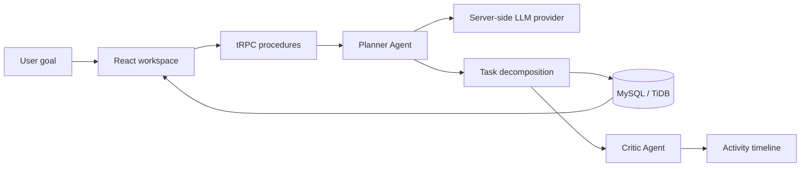

# Personal AI OS

Personal AI OS is an **AGI-inspired personal AI operating system** for turning high-level goals into visible, verified work. It is intentionally positioned as an autonomous AI workspace rather than a claim of true Artificial General Intelligence.

## What it does

The product centers on a safe execution loop:

> **User goal → understanding → planning → task decomposition → agent routing → execution status → critic verification → persistent workspace**

The current MVP includes a premium dark workspace interface, persistent goals and tasks, selective memory concepts, file-context surfaces, agent/tool registries, activity observability, authentication through the managed Manus OAuth flow, and a real server-side LLM planning endpoint.

## Features

- Goal-oriented orchestration input with safe execution status summaries.
- Planner/Critic workflow that uses the configured built-in LLM and returns structured plan data.
- User-scoped goals, tasks, memory, conversations, and activity tables.
- Task completion with automatic goal progress recalculation.
- Activity timeline for planner, task, memory, and critic events.
- Agent registry and tool registry views with permission-aware language.
- Responsive desktop-first UI for desktop, tablet, and mobile.
- Human approval boundary surfaced in settings; sensitive actions are not automatically sent.
- Protected workflow procedures and user-level data filtering.
- No exposed chain-of-thought; the UI shows only safe execution milestones.

## Architecture



### Repository layout

```text
client/
  src/pages/Home.tsx              # Main OS workspace and feature views
  src/App.tsx                     # Routes and theme shell
  src/index.css                   # Dark visual system
server/
  routers.ts                      # tRPC contracts and workflow orchestration
  db.ts                           # User-scoped database helpers
driver/
  ...
drizzle/
  schema.ts                       # Users, goals, tasks, memory, activity, conversations
  0001_sleepy_morph.sql           # Initial application migration
server/personal-ai-os.test.ts     # Workflow boundary tests
```

## Agent architecture

The MVP exposes the core specialist boundaries in the interface and uses the Planner/Critic pair in the live workflow path.

| Agent | Responsibility | Current status |
| --- | --- | --- |
| Planner Agent | Understand intent, create a goal, decompose tasks, assign agents | Live server-side workflow |
| Research Agent | Gather and synthesize useful information | Registry and activity surface |
| Task Agent | Manage task status and goal progress | Live persistence path |
| Memory Agent | Selectively save useful long-term context | Data model and UI surface |
| File Agent | Ground future responses in uploaded documents | UI and architecture surface |
| Critic Agent | Review plan completeness and approve/reject | Live approval event in workflow |
| Communication Agent | Draft, but never auto-send, communication | Registry and approval boundary |

## Data model

The database includes the following user-scoped tables:

- `users`
- `goals`
- `tasks`
- `memories`
- `activityEvents`
- `conversations`
- `messages`

The schema deliberately keeps file bytes out of the database. The next implementation step for full RAG is to add file metadata and storage references, then connect document extraction, chunking, embeddings, and retrieval.

## Setup

This project uses the managed full-stack WebDev template: React 19, Vite, TypeScript, Tailwind CSS, Express, tRPC, Drizzle, MySQL/TiDB, S3 storage, and Manus OAuth.

```bash
pnpm install
pnpm db:push
pnpm dev
```

The development server runs on port `3000`. Production validation is available with:

```bash
pnpm check
pnpm test
pnpm build
# Live database + LLM workflow smoke test (creates and cleans up one test goal)
pnpm tsx scripts/test-plan-my-week.ts
```

## Environment variables

The managed environment injects the platform credentials. For self-hosted development, provide the variables below through your deployment's secret manager or local environment; never commit `.env` files.

| Variable | Purpose |
| --- | --- |
| `DATABASE_URL` | MySQL/TiDB connection string |
| `JWT_SECRET` | Session signing secret |
| `VITE_APP_ID` | OAuth application identifier |
| `OAUTH_SERVER_URL` | OAuth service base URL |
| `VITE_OAUTH_PORTAL_URL` | Frontend login portal URL |
| `BUILT_IN_FORGE_API_URL` | Server-side LLM and platform API base URL |
| `BUILT_IN_FORGE_API_KEY` | Server-side platform API credential |
| `VITE_FRONTEND_FORGE_API_URL` | Frontend-safe platform API base URL |
| `VITE_FRONTEND_FORGE_API_KEY` | Frontend-safe platform API credential |

Never commit `.env` or hard-code secrets.

### External service matrix

| Service | Why it is needed | Environment variable(s) | MVP status |
| --- | --- | --- | --- |
| Managed MySQL/TiDB | Persists users, goals, tasks, memory, conversations, and activity | `DATABASE_URL` | **Required now** |
| Manus OAuth | Login, session identity, and protected user workspace | `VITE_APP_ID`, `OAUTH_SERVER_URL`, `VITE_OAUTH_PORTAL_URL`, `JWT_SECRET` | **Required now** |
| Built-in Forge LLM gateway | Planner/Critic structured workflow generation; credentials remain server-side | `BUILT_IN_FORGE_API_URL`, `BUILT_IN_FORGE_API_KEY` | **Required now** for AI runs |
| S3-compatible managed storage | File bytes and document assets when file upload/RAG is implemented | Managed storage configuration; no app-specific key is currently required | Future file/RAG phase |
| Web search provider | Research Agent live search and source citations | No variable is wired yet; add a provider-specific server secret when implemented | Future integration |
| Embeddings provider | Semantic memory and document retrieval | No variable is wired yet; use a server-side provider key when implemented | Future integration |
| ChromaDB or another vector store | Stores document chunks and embeddings for RAG | No variable is wired yet; likely `CHROMA_HOST` plus credentials | Future integration |
| MongoDB | Alternative database mentioned in the original concept | None; this project uses MySQL/TiDB instead | Not required / not wired |
| Gmail/SMTP | Sending approved email after a human review step | No variable is wired yet; add provider credentials only with the integration | Future integration |
| Google Calendar | Calendar-aware planning and schedule retrieval | No variable is wired yet; add OAuth client credentials only with the integration | Future integration |
| Google Maps | Optional map component shipped by the template | `VITE_FRONTEND_FORGE_API_URL`, `VITE_FRONTEND_FORGE_API_KEY` | Not used by current MVP |

There is no direct `OPENAI_API_KEY` requirement in the current deployment: the server calls the managed LLM gateway through `BUILT_IN_FORGE_API_URL` and `BUILT_IN_FORGE_API_KEY`. No web-search, embedding, MongoDB, email, Calendar, or Chroma credentials should be added until those integrations are actually implemented.

## API contracts

The app uses tRPC instead of a hand-written REST client. The main procedures are:

- `auth.me` and `auth.logout`
- `system.health`
- `dashboard.get`
- `dashboard.runWorkflow`
- `dashboard.createGoal`
- `dashboard.toggleTask`
- `dashboard.deleteGoal`
- `memory.list`
- `memory.create`
- `activity.list`

`dashboard.runWorkflow` accepts a natural-language prompt, calls the server-side LLM using a JSON schema, persists a goal and up to eight tasks, records safe activity events, and returns the verified plan summary.

## Security boundaries

All persistent feature procedures use `protectedProcedure`. Queries filter by `ctx.user.id`, and the workflow never exposes provider keys or hidden prompts to the browser. Email and other sensitive external actions are represented as approval-required capabilities and are not automatically sent in this MVP.

## Verification

The project currently passes:

- TypeScript validation with `pnpm check`
- Vitest suite with three passing tests
- Production build with `pnpm build`
- Desktop preview checks for overview, tasks, and agents
- Mobile preview check at 375×812

## Next improvements

The next product increment should add real file upload metadata and parsing, Chroma-backed retrieval, embeddings, research-source citations, approval records, conversation history UI, and a more complete LangGraph-equivalent execution graph. Those capabilities should be added incrementally without weakening the current user isolation and approval boundaries.
